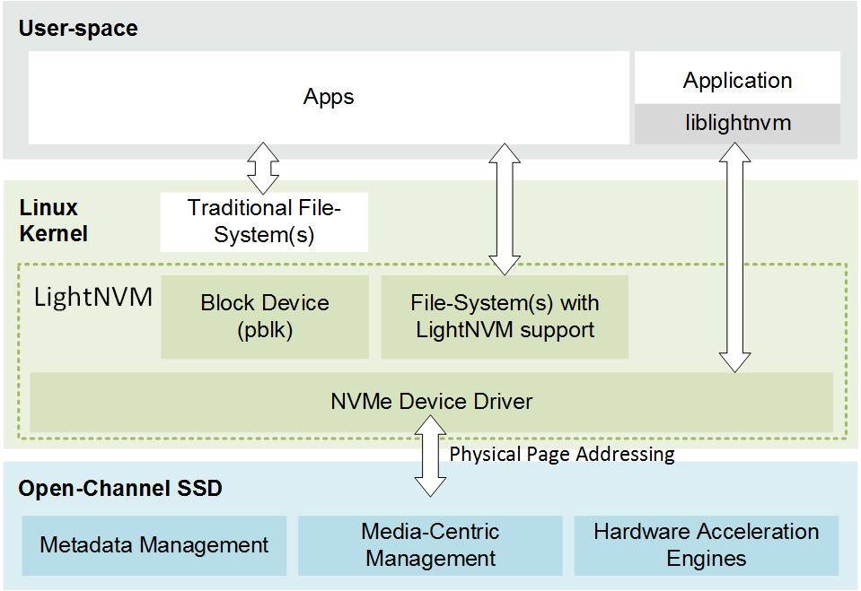

# Open-Channel Solid State Drives
A new class of SSDs has been developed known as Open-Channel SSDs. Open-Channel SSDs differ from a traditional SSD in that they expose the internal parallelism of the SSD to the host and allows it manage it. This allows Open-Channel SSDs to provide three properties to the host: I/O isolation, predictable latencies, and software-defined non-volatile memory.

## I/O Isolation 
I/O isolation provides a method to divide the capacity of the SSD into a number of I/O channels that map the parallel units of the device (LUNs). This enables an Open-Channel SSD to be  used in multi-tenant applications without tenants interfering with each other. 

## Predictable latency 
Predictable latency is achieved by having control in the host over when, where and how I/O are submitted to the SSD.

## Software-Defined Non-Volatile Memory
By integrating the SSD flash translation layer into the host, workload optimizations can be applied either within a self-contained flash translation layer, file-system integration or applications themselves. 

Figure 1 shows the division of responsibility between the host and SSD. The host implements generic FTL functionality in the host: data placement, I/O scheduling and GC; and exposes a traditional block device to user space. Media-centric metadata, error handling, scrubbing and wear-leveling are handled by the controller. In this way, the host can manage tradeoffs related to throughput, latency, power consumption and capacity. This division of labor between the SSD and host makes it possible to an Open-Channel SSD to abstract the actual media, while allowing the host to have control over all I/Os being submitted to the media.

