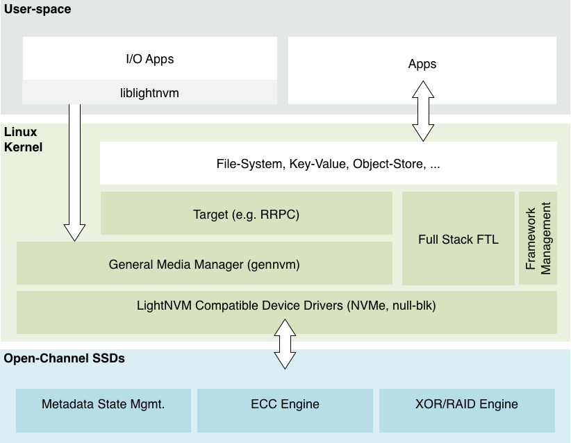

# Open-Channel Solid State Drives
Open-Channel SSDs are devices that share responsibilities with the host to implement and maintain features that typical SSDs keep strictly in firmware. These include (i) the Flash Translation Layer (FTL), (ii) bad block management, and (iii) dedicated hardware units such as the flash controller, the interface controller, and large amounts of flash chips.

The motivation for moving certain responsibilities to the host is to make I/O data commands predictable from the host-side. In this way, the device enables the host to adapt the FTL algorithms and optimizations to match the appropriate user workloads that it executes. Adapting the behavior of the FTL to manage one or several SSDs directly in software, making it possible for the device to accommodate changing workloads. 

An example of a shared responsibility configuration is the following: The host manages data placement, garbage collection, and has knowledge about the parallel units within the device to schedule and manage I/O streams. The device manages bad blocks, ECC and how to write to the non-volatile memory it has attached. 

The baseline is that Open-channels SSD exposes direct access to their physical flash storage while keeping a subset of the internal features of traditional SSDs. The responsibilities delegated to the host depends entirely on the device capabilities.

In Figure 1, the Linux host architecture for Open-channel SSDs is depicted. It consists of four fundamental components: LightNVM compatible device driver, framework manager, media manager, and targets.

## Device Drivers
The device drivers are responsible for implementing the storage protocol use for communication between host and SSD. The protocol includes (i) identify device structure, used by the host to discover its geometry. (ii) A series of commands that enables direct access to the non-volatile memory attached. The Linux kernel NVMe and null_blk driver currently supports the protocol.

## Media Managers
The media manager abstracts the underlying physical media by hiding its constraints and access details. It is responsible for (i) name mapping between vendor specific and generic addressing format, (ii) device-specific SSD state management, and (iii) recovery – to guarantee durability when manipulating the metadata associated with SSD state management. Each media manager implementation can vary much depending on the needs of layers above. LightNVM’s generic media manager implements block management and lets targets or user space applications implement the actual FTL. Still, it is possible for a media managers to implement the entire FTL and manage userspace interfaces. For example, a media manager could expose a block device similar to a traditional block storage device. Such a media manager would manage functionalities such as data placement, garbage collection, and block management.

## Targets
When using the generic media manager, targets implement FTL functionality (e.g., translation logic, data placement, or garbage collection). They also expose a storage interface to user space. Examples of such interfaces include block devices, key-value stores, or object stores. Target and device (media manager) division, grouping and assignments are flexible in such a way that one device can be split and assigned to multiple targets or multiple devices can belong to one target.

Additionally, LightNVM connects to user space through liblightnvm, which exposes a get_block/put_block interface for applications to implement their own FTLs.

Additionally, LightNVM connects to user space through liblightnvm, which exposes
a get_block/put_block interface for applications to implement their own FTLs.

## LightNVM Management
The  management acts as a mediator between device drivers, media managers, and targets. It provides supporting functionalities for device initialization, teardown or accounting.
